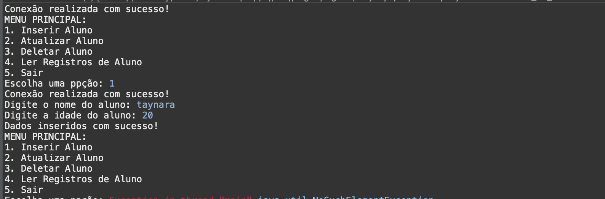

# Conexão com Banco de Dados MySQL (JDBC) - Projeto ConexaoBD

Este projeto em Java utiliza o JDBC para realizar operações de conexão e manipulação de dados em um banco de dados MySQL. O objetivo é demonstrar a criação e execução de operações básicas como inserção, leitura, atualização e exclusão de dados, utilizando o WAMP como servidor local de banco de dados.

---

## 📋 Funcionalidades
1. **Inserir Dados**: Conectar ao banco de dados e inserir dados na tabela.
2. **Ler Dados**: Ler e exibir dados do banco de dados.
3. **Atualizar Dados**: Atualizar informações específicas no banco de dados.
4. **Excluir Dados**: Excluir registros do banco de dados.
5. **Interface Command-Line**: Interface interativa para gerenciar o banco de dados diretamente pelo terminal.

---

## 🔧 Tecnologias Utilizadas
- **Linguagem**: Java
- **API**: JDBC (Java Database Connectivity)
- **Servidor de Banco de Dados**: WAMP (com MySQL)
- **IDE**: IntelliJ, Eclipse ou NetBeans
- **Ferramenta de Versionamento**: Git

---

## 🛠️ Etapas do Projeto

### Etapa 1: Conexão e Inserção de Dados
1. **Configuração do Ambiente**:
   - Instalar o **WAMP** para rodar o MySQL localmente.
   - Criar um banco de dados chamado `conexao_bd` no **phpMyAdmin**.
   - Criar uma tabela simples `clientes` no banco de dados com os campos `id`, `nome` e `email`.
   - Configuração de conexão via JDBC para acessar o MySQL a partir de Java.

